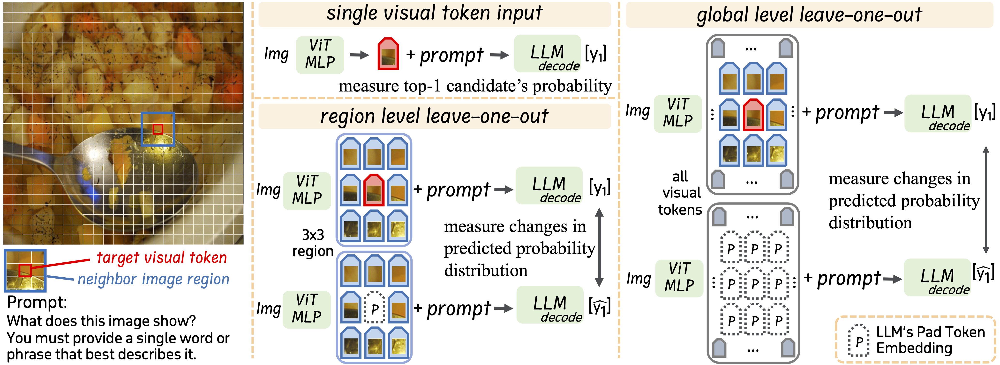
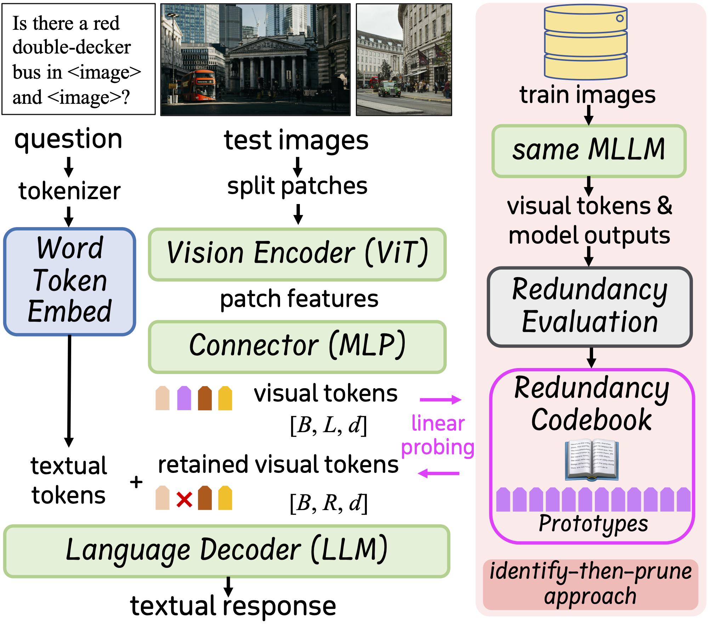

<p align="center" width="100%">
<a target="_blank"></a>
</p>

# Beyond Intermediate States: Explaining Visual Redundancy through Language

## 🙋🏼‍♂️🙋🏽🙋🏻‍♀️ Introduction

Multi-modal Large Langue Models (MLLMs) often process thousands of visual tokens, which consume a significant portion of the context window and impose a substantial computational burden. Prior work has empirically explored visual token pruning methods based on MLLMs’ intermediate states (e.g., attention scores). However, they have limitations in precisely defining visual redundancy due to their inability to capture the influence of visual tokens on MLLMs’ visual understanding (i.e., the predicted probabilities for textual token candidates). To address this issue, we manipulate the visual input and investigate variations in the textual output from both token-centric and context-centric perspectives, achieving intuitive and comprehensive analysis. Experimental results reveal that visual tokens with low ViT−[cls] association and low text-to-image attention scores can contain recognizable information and significantly contribute to images’ overall information. To develop a more reliable method for identifying and pruning redundant visual tokens, we integrate these two perspectives and introduce a context-independent condition to identify redundant prototypes from training images, which probes the redundancy of each visual token during inference. Extensive experiments on single-image, multi-image and video comprehension tasks demonstrate the effectiveness of our method, notably achieving 90% to 110% of the performance while pruning 80% to 90% of visual tokens.

## 🪜 Updates
- [2025-06-14]: 📖📖 We release our source code and codebooks (sorry for the delay 😉).
- [2025-03-26]: 🎉🎉 Our [Paper](https://arxiv.org/abs/2503.20540) is available on Arxiv.

## 🖼️ Method Overview

<p align="center" width="100%">
<a target="_blank"></a>
</p>

- We propose a novel method to identify and prune redundant visual tokens during MLLMs' inference stage.

## 🎮 Getting started

- Prepare the environment following the [LLaVA-Next Repository](https://github.com/LLaVA-VL/LLaVA-NeXT).

- All evaluation scripts are under the `eval/` directory, please assign your model and data path in these inference scripts.

- The `experiments/` folder contain all scripts to reproduce our proposed single-input and cascaded leave-one-out experiments.
    - 1. run `token_reduce_vit_cls_coco_caption_llava15.py` to obtain visual tokens and logits output. Please refer to line 308 to 314 of this script.
    - 2. run `token_reduce_vit_cls_coco_single_patch_infer_llava_merge_results_probs.py` to get results from the single-input experiment.
    - 3. run `token_reduce_vit_cls_coco_single_patch_infer_llava_context_tgt_pad_jsd.py` to get the results from the local- and global-level leave-one-out experiments. Please refer to the comments in this script 🌹.
    - 4. run `token_reduce_find_group_toxic_visual_tokens_llava15_dpcknn.py` to get the redundancy codebook.
    - 5. **for a quick start, we also release the redundancy prototypes we use for three MLLMs in the `codebooks/` folder** 😉.

- The core implementation of our method is in `LLaVA_NeXT/llava/model/llava_arch.py` and `LLaVA_NeXT/llava/model/multimodal_encoder/clip_encoder.py`. You may simply put these two files in your working directory to use the redundancy codebook during inference.

    - NOTE: Please add the extra fileds in `model_configs/llama3-llava-next-8b/config.json` to the config file in your model path, set `toxic_codebook_path` to the codebook path to load, and set `toxic_codebook_thres` to control the number of retained visual tokens (lower value results in fewer visual tokens).

## Citation

If you find it useful for your research and applications, please cite related papers/blogs using this BibTeX:
```bibtex
@article{yang2025beyond,
  title={Beyond Intermediate States: Explaining Visual Redundancy through Language},
  author={Yang, Dingchen and Cao, Bowen and Zhang, Anran and Gu, Weibo and Hu, Winston and Chen, Guang},
  journal={arXiv preprint arXiv:2503.20540},
  year={2025}
}
```
